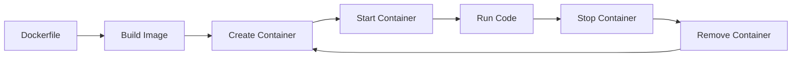

# Docker Guide for Beginners

This guide explains Docker concepts and how this template uses containerization to create a consistent Python development environment.

## 🐳 What is Docker?

Docker is a platform that packages applications and their dependencies into lightweight, portable **containers**. Think of containers as:

- **Virtual machines**, but much faster and lighter
- **Shipping containers** for code - they work the same everywhere
- **Isolated environments** - your code runs separately from your host system

### Why Use Docker for Python?

**Traditional Problems:**
- "It works on my machine" - different Python versions, missing libraries
- Complex setup - installing Python, managing virtual environments
- Dependency conflicts - library version mismatches
- Platform differences - Windows vs Mac vs Linux compatibility

**Docker Solutions:**
- ✅ **Consistent environment** - Same setup for everyone
- ✅ **Easy setup** - One command to get everything running
- ✅ **Isolated dependencies** - No conflicts with your system
- ✅ **Reproducible** - Works identically everywhere

**💡 Windows Users**: For the best Docker experience on Windows, use WSL2 (Windows Subsystem for Linux). This provides native Linux compatibility and significantly better performance than Docker on native Windows.

## 🏗️ Docker Components in This Template

### 1. Docker Image
A **blueprint** for creating containers. Like a recipe that includes:
- Operating system (Ubuntu Linux)
- Python 3.11 installation
- Required libraries from requirements.txt
- Your application code

### 2. Docker Container
A **running instance** of an image. Like a virtual computer that:
- Runs your Python code
- Has its own file system
- Stays isolated from your host system
- Can be started, stopped, and removed

### 3. Dockerfile
A **text file** with instructions to build the image:

```dockerfile
# Use official Python runtime as base image
FROM python:3.11-slim

# Set working directory in container
WORKDIR /app

# Set environment variables
ENV PYTHONUNBUFFERED=1
ENV PYTHONDONTWRITEBYTECODE=1

# Install system dependencies
RUN apt-get update && apt-get install -y \
    gcc \
    && rm -rf /var/lib/apt/lists/*

# Copy requirements file
COPY requirements.txt .

# Install Python dependencies
RUN pip install --no-cache-dir -r requirements.txt

# Copy the source code
COPY . .

# Create a non-root user for security
RUN useradd --create-home --shell /bin/bash app && chown -R app:app /app
USER app

# Command to run when container starts
CMD ["python", "main.py"]
```

**Line by Line Explanation:**
- `FROM python:3.11-slim` - Start with official Python 3.11 image
- `WORKDIR /app` - Set `/app` as the working directory inside container
- `ENV` lines - Set environment variables for better Python behavior
- `RUN apt-get...` - Install system-level dependencies (like gcc for compiling)
- `COPY requirements.txt .` - Copy requirements file into container
- `RUN pip install...` - Install Python libraries
- `COPY . .` - Copy all your code into container
- `RUN useradd...` - Create non-root user for security
- `USER app` - Switch to non-root user
- `CMD` - Default command when container starts

### 4. Volume Mounting
**Shares files** between your computer and the container:
- Changes to files on your computer appear instantly in container
- No need to rebuild container for code changes
- Data persists when container is stopped

## 🔧 Docker Commands Explained

### Basic Commands (handled by Makefile)

```bash
# Build image from Dockerfile
docker build -t python-learning .

# Run container with volume mounting
docker run -it --name python-learning \
  -v $(pwd):/app \
  python-learning

# Execute command in running container
docker exec -it python-learning python main.py

# Stop container
docker stop python-learning

# Remove container
docker rm python-learning

# List running containers
docker ps

# List all containers
docker ps -a

# List images
docker images

# Remove image
docker rmi python-learning
```

### How Makefile Simplifies This

Instead of remembering complex Docker commands, you use simple make commands:

```bash
make up     # = docker-compose up -d
make down   # = docker-compose down
make shell  # = docker exec -it python-learning /bin/bash
```

## 🐳 Docker vs Virtual Machines

| Aspect | Docker Containers | Virtual Machines |
|--------|------------------|------------------|
| **Speed** | Seconds to start | Minutes to boot |
| **Size** | MBs | GBs |
| **Resources** | Share host OS kernel | Full OS per VM |
| **Isolation** | Process-level | Hardware-level |
| **Use Case** | Development, microservices | Running different OS |

## 🔄 Container Lifecycle



1. **Build**: Create image from Dockerfile
2. **Create**: Make container from image
3. **Start**: Launch the container
4. **Execute**: Run your Python code
5. **Stop**: Halt container execution
6. **Remove**: Delete container (image remains)

## 🛡️ Security Features

### Non-Root User
This template creates and uses a non-root user (`app`) inside the container:

```dockerfile
RUN useradd --create-home --shell /bin/bash app && chown -R app:app /app
USER app
```

**Why?**
- Prevents privilege escalation attacks
- Follows security best practices
- Reduces risk of system damage

### Isolated Environment
- Container can't access your host files (except mounted volumes)
- Network isolation (unless ports are exposed)
- Process isolation from host system

## 📁 File System in Containers

### Container File System
```
/
├── app/                 # Your code (mounted from host)
│   ├── main.py
│   ├── examples/
│   └── requirements.txt
├── usr/
│   └── local/
│       └── lib/
│           └── python3.11/  # Installed packages
└── home/
    └── app/            # User home directory
```

### Volume Mounting
Your project files are **mounted** into the container:

```yaml
volumes:
  - .:/app              # Host current directory → Container /app
  - /app/__pycache__    # Exclude Python cache files
```

This means:
- ✅ Edit files on your computer with any editor
- ✅ Changes appear instantly in container
- ✅ Files persist when container is stopped
- ❌ Python cache files stay in container (cleaner host)

## 🌐 Networking (Advanced)

### Port Mapping
If you need to expose web services:

```yaml
services:
  python-app:
    ports:
      - "8000:8000"  # Host port 8000 → Container port 8000
```

### Container Communication
Multiple containers can talk to each other through Docker networks (covered in Docker Compose guide).

## 🔍 Debugging and Troubleshooting

### View Container Logs
```bash
make logs
# or
docker logs python-learning
```

### Access Container Shell
```bash
make shell
# or
docker exec -it python-learning /bin/bash
```

### Inspect Container
```bash
docker inspect python-learning
```

### Check Resource Usage
```bash
docker stats python-learning
```

## 📊 Common Docker Issues and Solutions

### Issue: "Container not found"
**Problem**: Container hasn't been created or has been removed
**Solution**: Run `make up` to create and start container

### Issue: "Port already in use"
**Problem**: Another process is using the same port
**Solution**: 
- Stop the other process
- Change port in docker-compose.yml
- Use `docker ps` to find conflicting containers

### Issue: "Permission denied"
**Problem**: User doesn't have Docker permissions
**Solution**:
- Add user to docker group: `sudo usermod -aG docker $USER`
- Restart terminal/computer
- On Windows: Run as Administrator

### Issue: "Image not found"
**Problem**: Docker image hasn't been built
**Solution**: Run `make build` or `make up`

### Issue: "No space left on device"
**Problem**: Docker is using too much disk space
**Solution**: Clean up Docker: `make clean` or `docker system prune`

## 🎯 Best Practices

### Development
1. **Use .dockerignore** - Exclude unnecessary files from image
2. **Layer caching** - Order Dockerfile commands for efficient builds
3. **Multi-stage builds** - Separate build and runtime environments
4. **Health checks** - Monitor container status
5. **Resource limits** - Prevent containers from using too many resources

### Security
1. **Non-root user** - Always run as non-privileged user
2. **Minimal base images** - Use `slim` or `alpine` variants
3. **Update packages** - Keep base image and packages current
4. **Scan images** - Check for vulnerabilities
5. **Secrets management** - Don't put passwords in images

### Performance
1. **Small images** - Minimize image size
2. **Volume mounting** - Use for development files
3. **Resource limits** - Set CPU and memory constraints
4. **Clean up** - Regularly remove unused images and containers

## 🚀 Next Steps

### Learn More About Docker
- [Official Docker Tutorial](https://docs.docker.com/get-started/)
- [Docker Best Practices](https://docs.docker.com/develop/best-practices/)
- [Dockerfile Reference](https://docs.docker.com/engine/reference/builder/)

### Advanced Topics
- **Docker Compose** - Multi-container applications
- **Docker Swarm** - Container orchestration
- **Kubernetes** - Production container management
- **CI/CD Pipelines** - Automated testing and deployment

### Practical Applications
- **Microservices** - Break applications into small services
- **Development Environments** - Consistent setups for teams
- **Testing** - Isolated environments for tests
- **Deployment** - Package applications for production

## 📚 Additional Resources

- [Docker Hub](https://hub.docker.com/) - Find pre-built images
- [Docker Documentation](https://docs.docker.com/) - Official docs
- [Play with Docker](https://labs.play-with-docker.com/) - Browser-based Docker playground

---

**Understanding Docker helps you:**
- 🔧 Create consistent development environments
- 🚀 Deploy applications anywhere
- 🛡️ Isolate and secure your code
- 🤝 Share environments with team members

**Ready to dive deeper?** Check out the [Docker Compose Guide](docker-compose-guide.md) next!